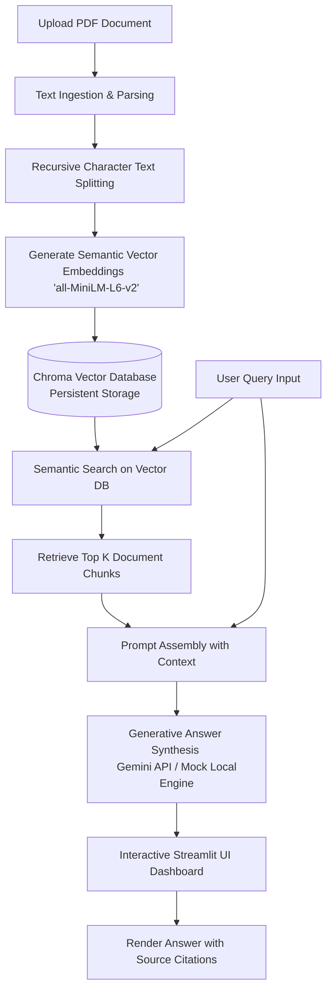

# DocuMind AI: Smart Document Research Assistant (RAG)

DocuMind AI is a state-of-the-art **Retrieval-Augmented Generation (RAG)** assistant built in Python. It allows users to upload technical documents, PDFs, or books and engage in a contextual chat. The system is designed to combat AI hallucinations by performing semantic search over documents using local vector embeddings, feeding only relevant context to the Large Language Model.

🚀 **Live Deployed App:** [](https://smart-doc-assistantgit-j5l6amuj89dkfysbyndqsv.streamlit.app/)

---

## 🛠️ System Architecture

The project is built on modular layers connecting document ingestion, storage, retrieval, and generative interfaces.



---

## 🌟 Key Features

* **Local Embeddings Processing:** Uses HuggingFace's lightweight `sentence-transformers/all-MiniLM-L6-v2` locally on your CPU to generate vector embeddings. No external internet or API costs are required for embedding computation.
* **Persistent Vector Store:** Integrates ChromaDB, a serverless vector database, storing index data directly to your project directory.
* **Intelligent Synthesis:** Integrates Google Gemini API to write high-quality, natural-language answers based *only* on context. If no API key is provided, the engine runs in a diagnostic "Local Mock Mode".
* **Source & Page Citation Engine:** Automatically tracks page metadata from PDFs. The UI highlights distance scores and exact text snippets, allowing the user to trace where the answer came from.
* **100% Python Frontend:** Written using Streamlit, featuring custom CSS styling and responsive layout.

---

## 🚀 Getting Started

### 1. Prerequisites
Ensure you have Python 3.9+ installed on your computer.

### 2. Setup Project Environment
Open your terminal inside the project directory and run the following commands:

```bash
# 1. Create a virtual environment
python -m venv venv

# 2. Activate the virtual environment
# On Windows:
venv\Scripts\activate
# On macOS/Linux:
source venv/bin/activate

# 3. Install required packages
pip install -r requirements.txt
```

### 3. Running the Application
Launch the web interface using Streamlit:

```bash
streamlit run app.py
```

Streamlit will automatically host the application locally and open a browser window at `http://localhost:8501`.

---

## 💡 How to Add Your API Key
1. Go to [Google AI Studio](https://aistudio.google.com/).
2. Click **Create API Key**.
3. Set the key:
   - **Locally:** Create a `.env` file in the project root and add `GEMINI_API_KEY=your_key`.
   - **Streamlit Cloud:** Add a Secret named `GEMINI_API_KEY` with your key in the Streamlit App Settings -> Secrets panel.

---

## 📝 Placement Resume Copy-Paste Template
Below are professional bullet points you can copy directly onto your resume:

* **Smart Document Research Assistant (Generative AI & RAG)**
  * Engineered a Retrieval-Augmented Generation (RAG) system utilizing **LangChain**, **ChromaDB**, and **Google Gemini API** to enable interactive, context-aware Q&A on multi-page PDF files.
  * Designed a semantic ingestion pipeline that processes documents using **HuggingFace Sentence-Transformers (all-MiniLM-L6-v2)** to compute local embeddings, saving data persistently on the edge.
  * Formulated a search citation system tracking distance scores and page boundaries to prevent AI hallucinations, outputting verified citations alongside answers.
  * Built a responsive dashboard in **Streamlit** using Python-only components, facilitating file upload, metrics reporting, and real-time streaming queries.
